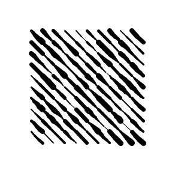
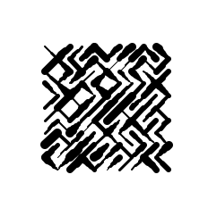
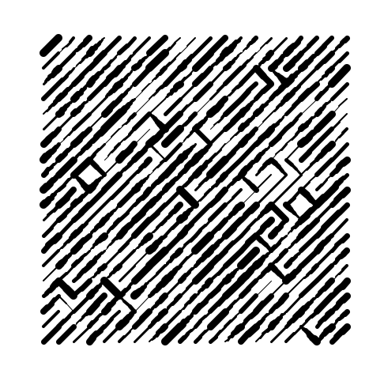
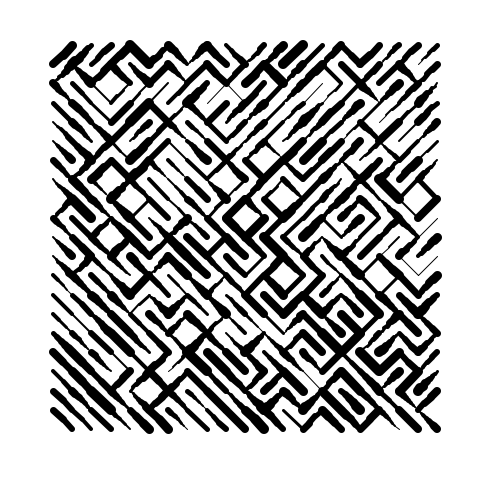
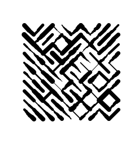

# generative-art-experiments

Some experiments with generative art

## 10print

10print, the [classic](https://10print.org/) C64 one-liner. And now, with varied brush strokes.

Looked interesting, even before adding the randomly alternating slashes.

With the slashes randomly alternating.

With the slashes heavily biased in one direction and more iterations.

Slash direction biased according to position on the canvas.

# Pen Plotter

I'd like to be able to print these on paper using a pen and ink or paint brushes.

## Brainstorm

### Some Parameters to Play With

- Speed of pen movement
- X/Y Cordinates to go to
- Pen pressure on the page (controlled by the Z axis). Say, 0-10 with 10 being the most pressure and 0 being the least. Or maybe 0 is reserved for "pen lifted off the page"

### Interpolation

I'd like to smoothly transitioning between (for example) full pressure to minimum pressure as the pen moves from one point to another. Mhy Monoprice 3D printer does this automatically as part of its firmware.

### Smooth Curves

Requires lots of interpolation in gcode. Maybe when I build a pen plotter and write custom firmware. Could do some cool generative stuff with epicycles and fourier transforms.

## Movement Function

I will use a simple method for dictating where the brush moves

- X: x coordinate where the print head moves
- Y: y coordinate wehre the print head moves
- Pressure: how much to press down on the page on a scale of 0-10.
- Speed: how fast to travel to the specified coordinate on a scale from 0-10. 0 is reserved for moving without drawing (ie, lift the brush off the page, move to the coordinate, then drop the brush to the specified pressure)

## Gcode

Gcode is the set of instructions commonly used by 3d printers. As a next step, I'm going to attach a pen to my 3d printer and use it as a pen plotter.

## Pen Holder

I 3D Printed a [pen holder](https://www.tinkercad.com/things/hDm1aAllVY3). I haven't optimized my printer settings yet, so some of the print is messy...

## Results

After lots of fiddling with the Z values to get the brush pressure just right, I was able to print a generative design.Yes, I used orthodontic elastics to attach the pen holder to the print head.

