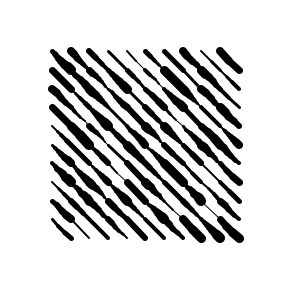
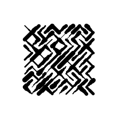
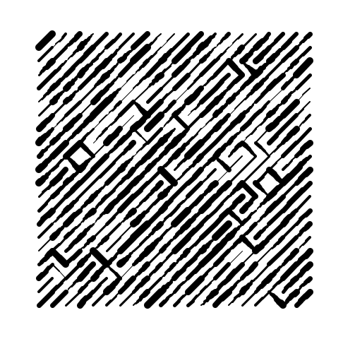
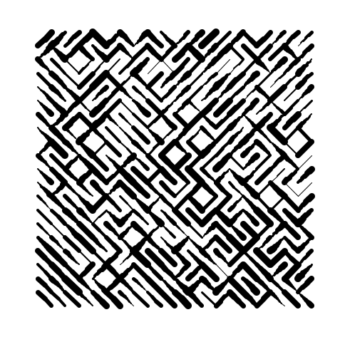

# generative-art-experiments

Some experiments with generative art

## 10print

10print, the [classic](https://10print.org/) C64 one-liner. And now, with varied brush strokes.

Looked interesting, even before adding the randomly alternating slashes.

With the slashes randomly alternating.

With the slashes heavily biased in one direction and more iterations.

Slash direction biased according to position on the canvas.

# Exploring gcode

Gcode is the set of instructions commonly used by 3d printers. As a next step, I'm going to attach a pen to my 3d printer and use it as a pen plotter.
